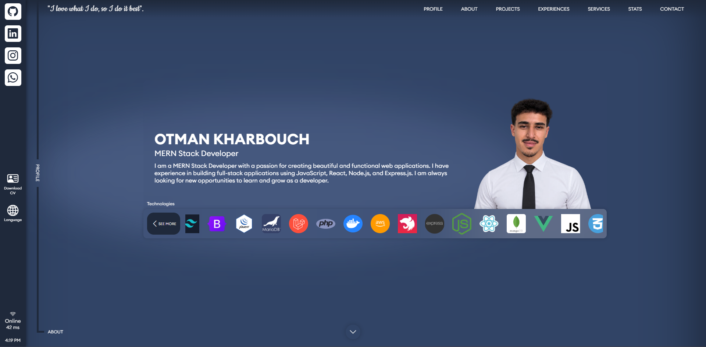
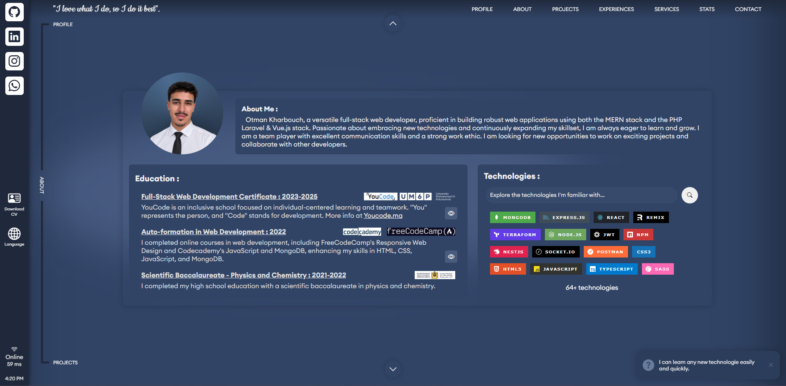
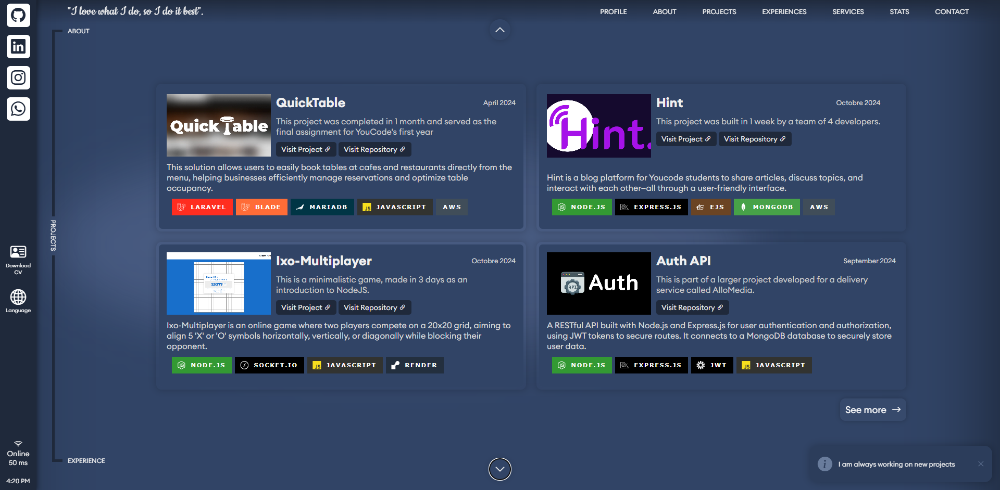
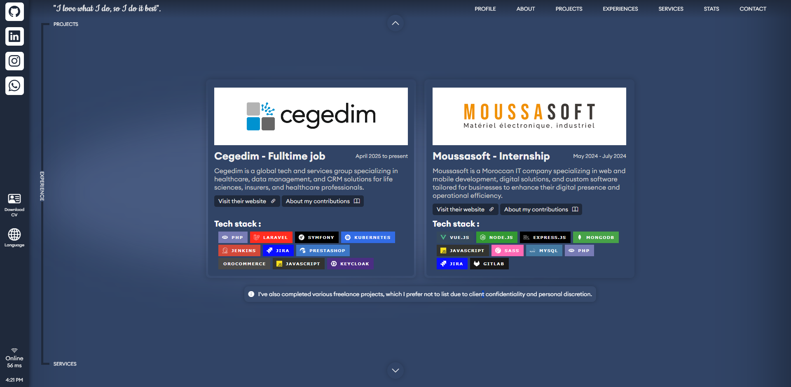
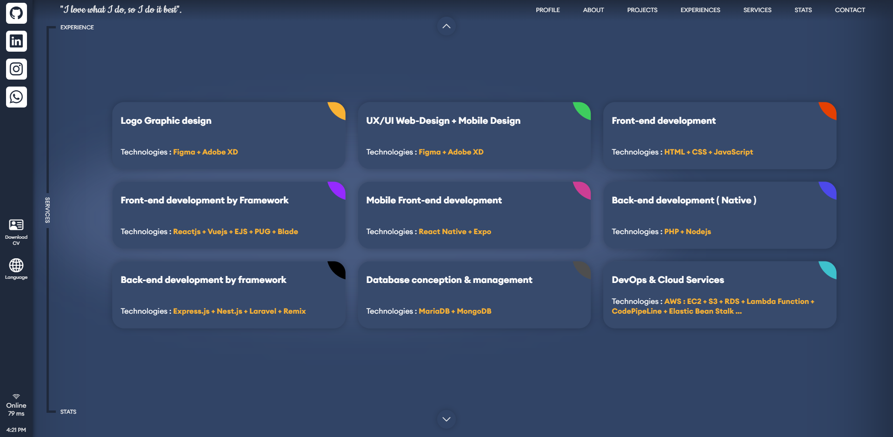
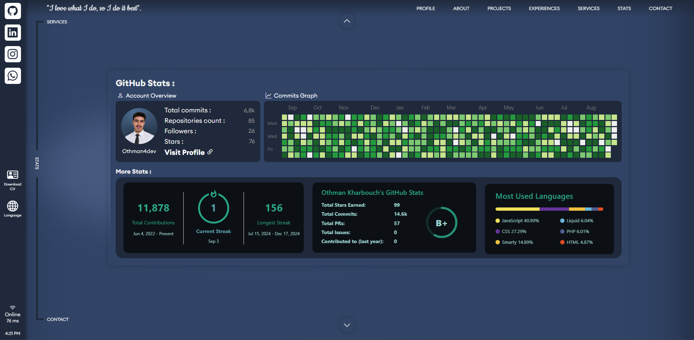
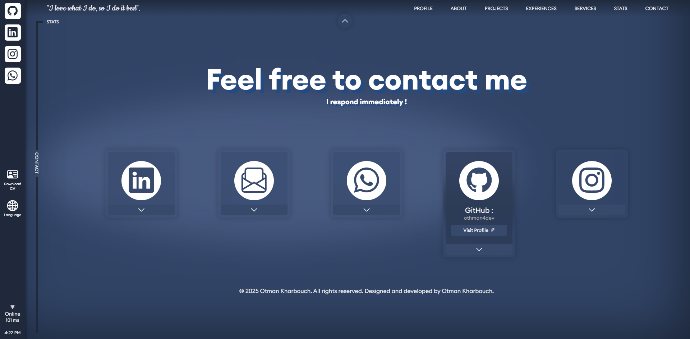

<div align="center">


# Otman Kharbouch — Interactive Portfolio

**A hand-crafted, multilingual, single-page portfolio with its own zero-dependency back-office.**

*"I love what I do, so I do it best."*

<br/>

[](https://othman4dev.site)
[](https://github.com/othman4dev)
[](#-license--usage-terms)

<br/>


</div>

---

## 📖 Table of Contents

- [Overview](#-overview)
- [Live Tour](#-live-tour)
- [Feature Highlights](#-feature-highlights)
- [The Back-Office](#-the-back-office-bo)
- [Tech Stack](#-tech-stack)
- [Architecture & Project Structure](#-architecture--project-structure)
- [Getting Started](#-getting-started)
- [Customization Guide](#-customization-guide)
- [License & Usage Terms](#-license--usage-terms)
- [Contact](#-contact)

---

## 🎯 Overview

This is a **100% original, template-free portfolio** — every section, animation and interaction was designed and coded from scratch. It's more than a static page: it ships with a **secure, self-hosted content back-office** that lets me edit every piece of text, in three languages, without ever touching the source code.

| | |
|---|---|
| 🌍 **Multilingual** | English · French · Arabic, switchable on the fly |
| 🧭 **Storytelling UX** | Seven vertically-navigated chapters that flow into one another |
| 🛠️ **Own CMS** | A dependency-free Node.js back-office to edit all content |
| 🔒 **Secure by design** | Scrypt-hashed auth, HttpOnly sessions, timing-safe checks |
| ⚡ **Framework-free front-end** | Pure HTML/CSS/JS — fast, lightweight, no build step |
| 📱 **Responsive** | Tuned for mobile, tablet and desktop |

> **Live at 👉 [othman4dev.site](https://othman4dev.site)**

---

## 🖼️ Live Tour

A section-by-section walkthrough of the experience.

### 1. Profile — The Hero
The landing chapter: name, title, a live technologies marquee, quick social rail, downloadable CV and a real-time connection indicator.



### 2. About & Education
A personal introduction paired with an academic timeline (YouCode × UM6P, Codecademy, FreeCodeCamp) and a **searchable index of 64+ technologies**.



### 3. Projects
A curated grid of flagship builds — QuickTable, Hint, Ixo-Multiplayer and Auth API — each with its stack, live link and repository.



### 4. Experiences
Professional journey cards for **Cegedim** (full-time) and **Moussasoft** (internship), complete with per-role tech stacks and contribution notes.



### 5. Services
Nine service offerings spanning design, front-end, mobile, back-end, databases and DevOps/Cloud.



### 6. Stats
A live **GitHub dashboard**: account overview, contribution heatmap, streaks, and a most-used-languages breakdown.



### 7. Contact
A friendly "Feel free to contact me" closer with expandable social cards for LinkedIn, email, WhatsApp, GitHub and Instagram.



---

## 🌟 Feature Highlights

- **🧭 Chapter navigation** — a unique vertical rail with smooth section-to-section transitions.
- **🌍 Real internationalization** — content lives in JSON (`lang/en.json`, `fr.json`, `ar.json`), including full RTL support for Arabic.
- **📊 Live GitHub stats** — contribution graph, streaks and language stats rendered dynamically.
- **🎭 Hand-coded animations** — lens transitions, hover effects and typed/animated text, no heavy libraries.
- **📄 One-click CV download** — always serving the latest résumé.
- **📶 Connection awareness** — an on-page online/offline + latency indicator.
- **📱 Mobile island & sidebar** — a bespoke mobile navigation pattern with double-tap interactions.

---

## 🛡️ The Back-Office (BO)

What makes this portfolio special is its **custom, self-hosted content management back-office** — written in **plain Node.js with zero external dependencies** ([server.js](server.js)).

### Why it exists
Text lives in language JSON files, not hard-coded in HTML. The BO gives a friendly UI to edit that content safely — so copy can be refined in any language without redeploying or editing code.

### Dashboard at a glance
Reachable at `/admin/admin.html` (protected — redirects to a login screen when unauthenticated), organized into tabs that mirror the public sections:

| Tab | Purpose |
|-----|---------|
| **Hero** | Edit the profile/landing copy |
| **About & Education** | Manage bio and the academic timeline |
| **Projects** | Update project titles, descriptions & metadata |
| **Experience** | Maintain professional history entries |
| **Stats** | Tune the stats section labels |
| **Contacts** | Edit contact details |
| **Compare** | Diff language files side-by-side to keep translations in sync |

Plus a live **language switcher (EN/FR/AR)**, an **attribute search**, **add-attribute** and **undo** controls.

### Security & safety model
- 🔑 **Scrypt password hashing** with per-user salt (no plaintext secrets stored).
- 🍪 **Session cookies** that are `HttpOnly`, `SameSite=Strict` and server-tracked.
- ⏱️ **Timing-safe comparison** to defend against timing attacks.
- 🔐 **Credentials via `.env`** (`ADMIN_USER`, `ADMIN_PASSWORD_HASH`) — in-app password change writes back atomically.
- 💾 **Automatic backups** — the last 3 snapshots per language are kept, with one-click **undo/restore**.
- 🧯 **Payload guarding** — request bodies are capped to prevent abuse.
- 🛟 **Local-first** — the dashboard explicitly edits the local content only; production stays untouched until you deploy.

### API surface

| Method | Endpoint | Description |
|--------|----------|-------------|
| `POST` | `/api/admin/login` | Authenticate and open a session |
| `POST` | `/api/admin/logout` | Destroy the current session |
| `GET`  | `/api/admin/status` | Health/auth status check |
| `POST` | `/api/admin/password` | Change the admin password |
| `GET`  | `/api/lang/{en\|fr\|ar}.json` | Read a language file |
| `PUT`  | `/api/lang/{en\|fr\|ar}.json` | Save edits (auto-backup first) |
| `POST` | `/api/lang/{en\|fr\|ar}.json/undo` | Restore the previous snapshot |

---

## 🧰 Tech Stack

**Front-end**


**Libraries & Icons**


**Back-office**


---

## 🏗️ Architecture & Project Structure

```
MyPortfolio/
├── index.html            # Single-page portfolio (7 sections)
├── server.js             # Zero-dependency Node.js server + back-office API
├── CNAME                 # Custom domain (othman4dev.site)
│
├── admin/
│   ├── admin.html        # Back-office dashboard UI
│   └── login.html        # Authentication screen
│
├── pages/
│   └── projects.html     # Full projects listing page
│
├── lang/                 # 🌍 Content source of truth
│   ├── en.json           # English strings
│   ├── fr.json           # French strings
│   └── ar.json           # Arabic strings (RTL)
│
├── scripts/
│   └── script.js         # Navigation, i18n, animations, GitHub stats
│
├── styles/
│   ├── style.css         # Core styling
│   ├── responsive.css    # Breakpoints & mobile layouts
│   └── admin.css         # Back-office styling
│
└── assets/
    ├── cv/               # Downloadable résumés
    ├── experiences/      # Company logos
    ├── images/           # Portrait, favicons, UI art
    ├── projects/         # Project artwork
    ├── schools/          # Education logos & swiper media
    ├── screenshots/      # Section previews (used in this README)
    └── technos/          # Technology icons
```

**Data flow:** `lang/*.json` → rendered by `scripts/script.js` into `index.html`. The back-office (`server.js`) reads and writes those same JSON files, so **content and presentation stay fully decoupled**.

---

## 🚀 Getting Started

### Prerequisites
- [Node.js](https://nodejs.org/) 18+ (for the back-office & local server)
- A modern web browser

### 1. Clone
```bash
git clone https://github.com/othman4dev/MyPortfolio.git
cd MyPortfolio
```

### 2. Run the server
```bash
node server.js
```
The site is served at **http://localhost:3000** (override with the `PORT` env var).

### 3. Configure the back-office
Create a `.env` file in the project root:
```env
ADMIN_USER=admin
ADMIN_PASSWORD_HASH=<salt:hash>   # scrypt "salt:key" pair
PORT=3000
```
Then visit **http://localhost:3000/admin/admin.html** — you'll be redirected to the login screen, and once authenticated you can edit every piece of content live.

> Prefer a quick static preview without the BO? Just open `index.html` in your browser.

---

## 🎨 Customization Guide

| Want to change… | Edit… |
|-----------------|-------|
| Any text (any language) | The back-office, or directly `lang/en.json` / `fr.json` / `ar.json` |
| Portrait / favicons / art | Files in `assets/images/` |
| Project artwork | `assets/projects/` |
| Colors & visual identity | `styles/style.css` |
| Responsive behavior | `styles/responsive.css` |
| Navigation & interactions | `scripts/script.js` |

---

## 📄 License & Usage Terms

> ### 🚨 This is an original, personal design.

The code is public for **reference and learning**. Please respect the craft that went into it:

| ✅ Do | ❌ Don't |
|-------|----------|
| Draw inspiration for your own unique design | Copy the design and pass it off as yours |
| Learn from the structure & techniques | Re-use it as-is without meaningful changes |
| Adapt individual components for your projects | Remove attribution |

**Want a custom, one-of-a-kind portfolio like this?** I build each one from scratch — [reach out](#-contact) and let's talk.

---

## 📞 Contact

<div align="center">

[](https://othman4dev.site)
[](mailto:otmankharbouch813@gmail.com)
[](https://github.com/othman4dev)
[](https://www.instagram.com/othman.is.me/)
[](https://wa.me/212704606597)

<br/>

**Made with ❤️ by Otman Kharbouch**

*If this project inspired you, consider leaving a ⭐ — it means a lot.*

</div>
